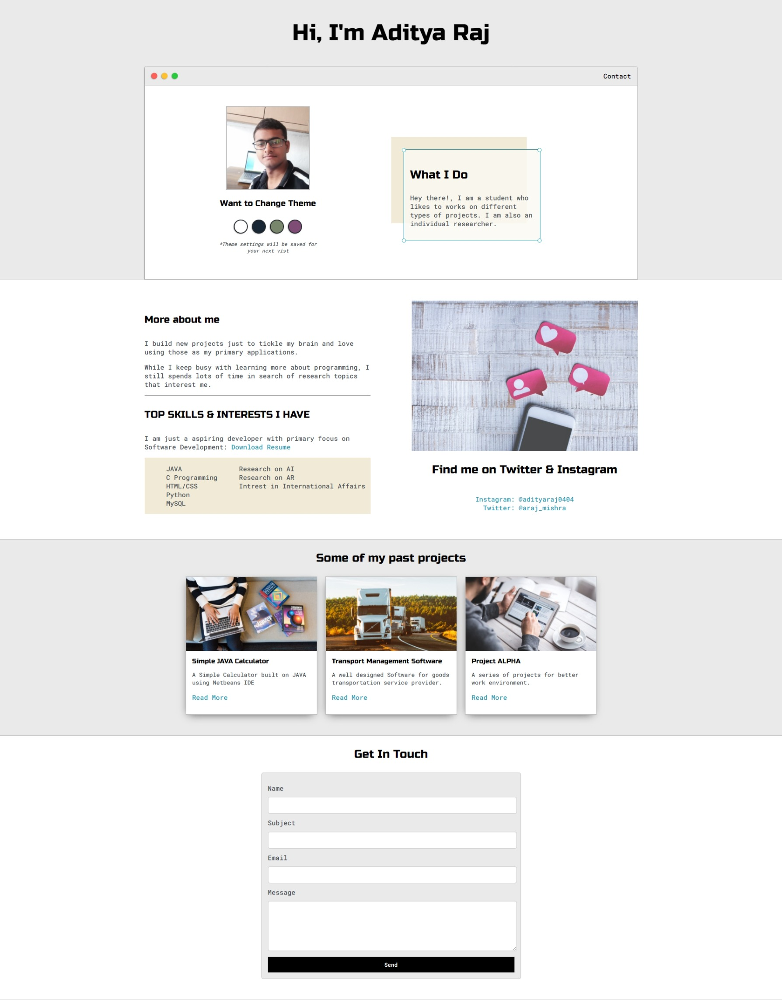

# Aditya Raj

## Table of Contents
* [General Info](#general-information)
* [Technologies Used](#technologies-used)
* [Features](#features)
* [Screenshots](#screenshots)
* [Setup](#setup)
* [Project Status](#project-status)
* [Contact](#contact)

## General Information
A portfolio website built on HTML and CSS.
This website gives overview of my Skills and Interests, also providing feature to contact.

## Technologies Used
- HTML-5
- CSS-3

## Features
- Simple UI
- Responsive
- User-friendly 
- Beautiful Colour Pallete

## Screenshots

## Setup
Extract the given zipped file. You may use Winrar for this. 
Open the extracted folder and click on `index.html` file to view the website.
For sample output of the website, go to img/output folder for screenshots 
of the site.

You can find the CSS file in style folder. Also image resources used in
site is free without any copyright issues. You can find the images in 
img/res folder.

## Project Status
 _completed_

## Contact
- Project By: **Aditya Raj**.
- <a href="mailto:founderafriends@gmail.com">Email Me</a>